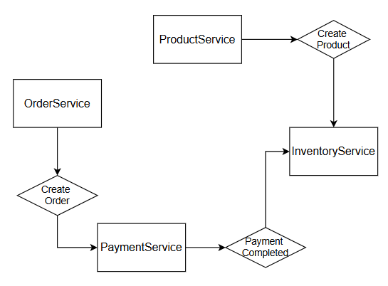
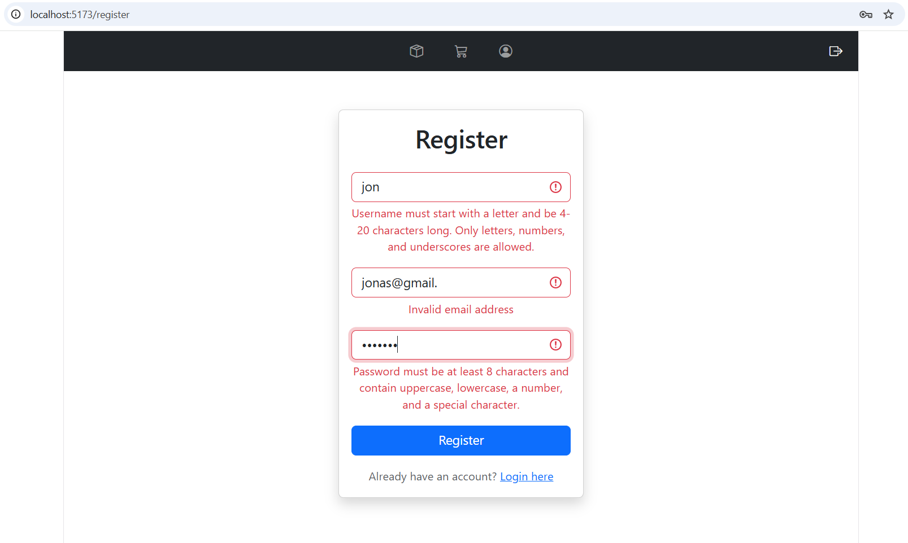
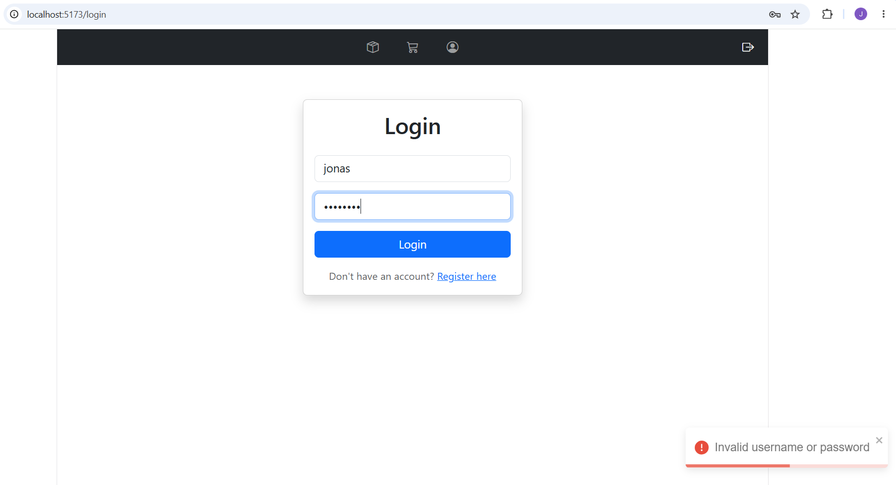
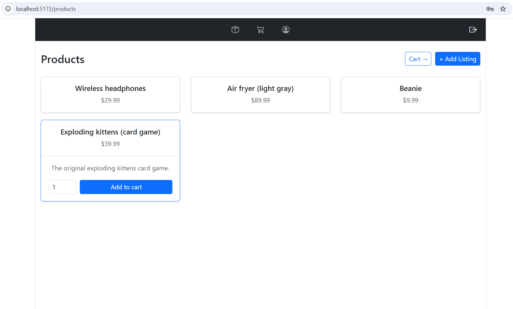
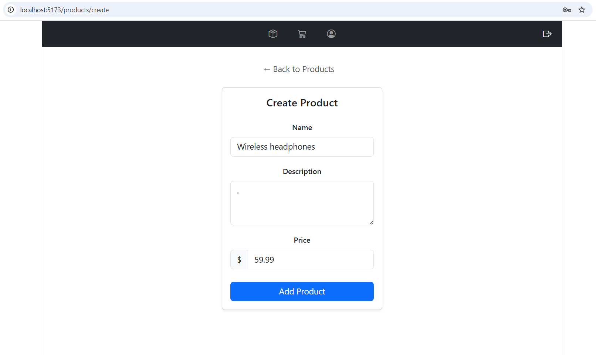
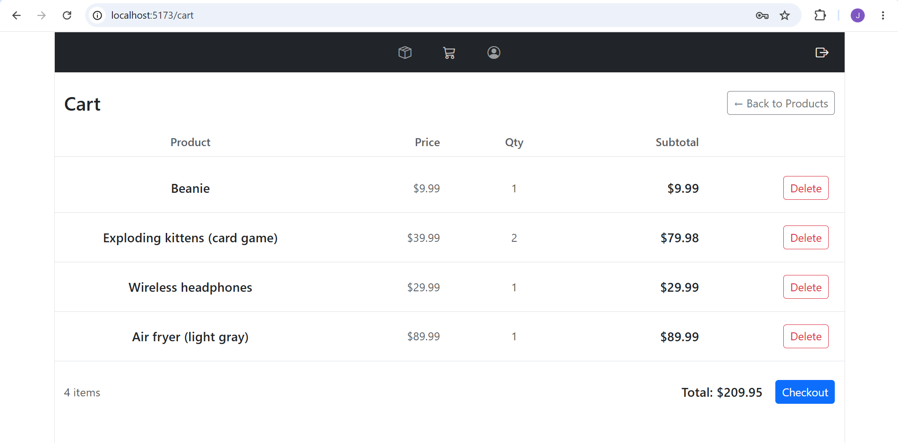
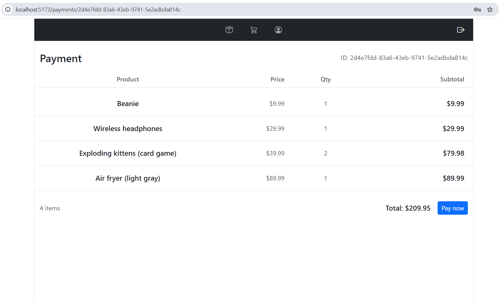
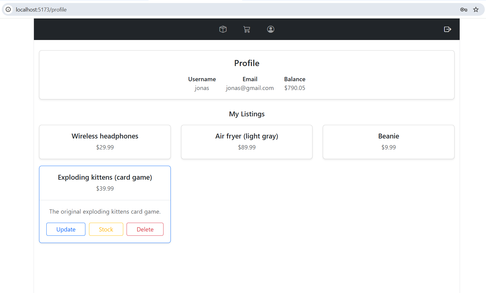
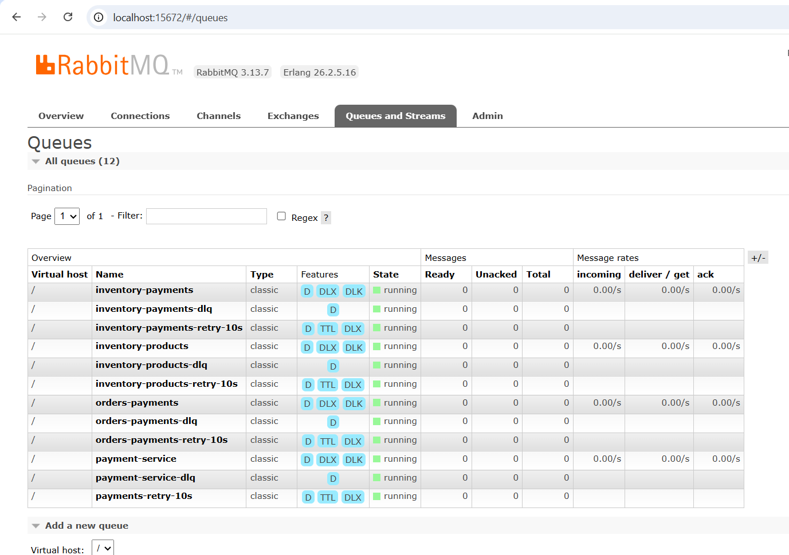

# DistributedOrderSystem

DistributedOrderSystem is an event-driven e-commerce backend + frontend built with ASP.NET Core, RabbitMQ and React.

While making this i focused on reliable messaging, service autonomy, and eventual consistency using the Outbox Pattern. Each microservice owns its own database and communicates through asynchronous events rather than direct database access. The system is fully containerized using Docker Compose.

---

# Architecture
The system consists of the following services:

- AuthService
- ProductService
- InventoryService
- OrderService
- PaymentService
- RabbitMQ
- React Frontend



Each service owns its own SQLite database and communicates either through RabbitMQ events or HTTP APIs when synchronous communication is required.

---
## Pages
### Register page

---
### Login page

---
### Products page for viewing products and adding them to your shopping cart

---
### If you click the "+ Add listing button", you get redirected to this page

---
### Cart page for viewing your cart before proceeding to payment

---
### Payment page for completing the payment: you get redirected to /products after completion

---
### Profile page for viewing profile details and making changes to your product listings

---

# Services

## AuthService

Responsible for authentication and user management.

Features:

- User registration
- User login
- JWT authentication
- Refresh tokens
- Single source of truth for storing user details

---

## ProductService

Responsible for product management.

Features:

- CRUD operations for products
- Product ownership
- Publishes product events
- Implements the Outbox Pattern

---

## InventoryService

Responsible for inventory management.

Features:

- Stores available stock
- Consumes product events
- Consumes payment events
- Updates inventory after successful payments
- Prevents duplicate message processing
- Inventory validation

---

## OrderService

Responsible for shopping carts and order creation.

Features:

- Shopping cart management
- Order creation
- Product validation
- Creates pending payments

---

## PaymentService

Responsible for payment processing.

Features:

- Completes payments
- Publishes payment events
- Implements the Outbox Pattern

---

# Messaging

RabbitMQ is used for asynchronous communication between services.
### Here is an overview of RabbitMQ management:


---

# Reliability

The project is designed around at-least-once message delivery.

## Outbox Pattern

Services publishing events first store them in an Outbox table inside the same database transaction.

Background workers periodically query their respective databases for unprocessed events. If found, they publish that event to RabbitMQ and marks them as processed only after successful delivery.

Implemented in:

- OrderService
- ProductService
- PaymentService

---

## Idempotent Consumers

Every event contains a unique MessageId.

Consumers store processed message IDs to ensure duplicate deliveries are ignored safely.

---

## Manual Message Acknowledgements

RabbitMQ messages are acknowledged only after successful processing.

Failed messages are retried automatically. After 3 failed attempts they are sent to their respective DLQ.

---

## Retry Logic

RabbitMQ publishers and consumers retry connections during application startup.

This prevents services from crashing if RabbitMQ is not yet ready when Docker starts the containers.

---

# Authentication

Authentication is implemented using JWT Bearer tokens.

Features:

- JWT access tokens
- Refresh tokens
- Role-based authorization
- ASP.NET Identity

---

# Technology Stack

Backend

- ASP.NET Core 8
- C#
- Entity Framework Core
- SQLite
- RabbitMQ

Frontend

- React
- TypeScript
- Vite
- Bootstrap

Infrastructure

- Docker
- Docker Compose


# Service URLs

| Service | URL |
|----------|----------------------------|
| Frontend | http://localhost:5173 |
| AuthService | http://localhost:7144 |
| ProductService | http://localhost:7165 |
| InventoryService | http://localhost:7248 |
| OrderService | http://localhost:7199 |
| PaymentService | http://localhost:7218 |
| RabbitMQ Management | http://localhost:15672 |

RabbitMQ credentials:

```
Username: guest
Password: guest
```

---

# Project Structure

```text
DistributedOrderSystem
│
├── frontend
│
├── src
│   ├── AuthService
│   ├── ProductService
│   ├── InventoryService
│   ├── OrderService
│   ├── PaymentService
│   └── SharedContracts
│
├── docker-compose.yml
└── README.md
```

---

# Features

- Event-driven architecture
- Microservice-based design
- RabbitMQ messaging
- Outbox Pattern
- Eventual consistency
- Idempotent consumers
- Retry queues and dead-letter queues
- JWT authentication
- Refresh tokens
- Role-based authorization
- Shopping cart
- Payment workflow
- Inventory management
- Dockerized deployment

---

---

# Running the Application

Start the application:

```bash
docker compose up --build
```
Open your browser and navigate to http://localhost:5173

PS: Building the application may take several minutes

